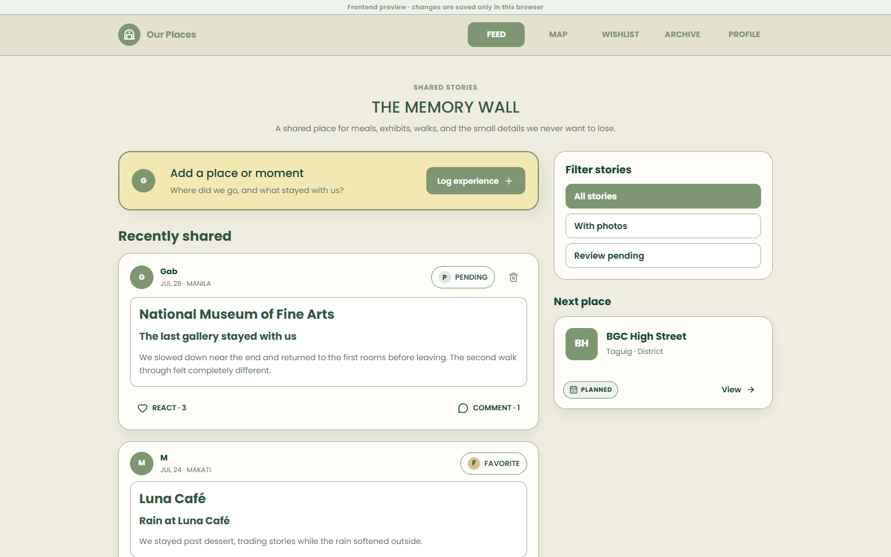
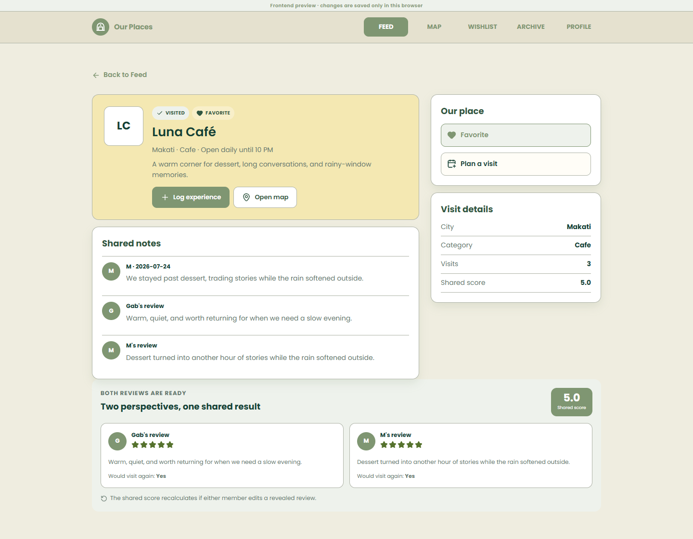
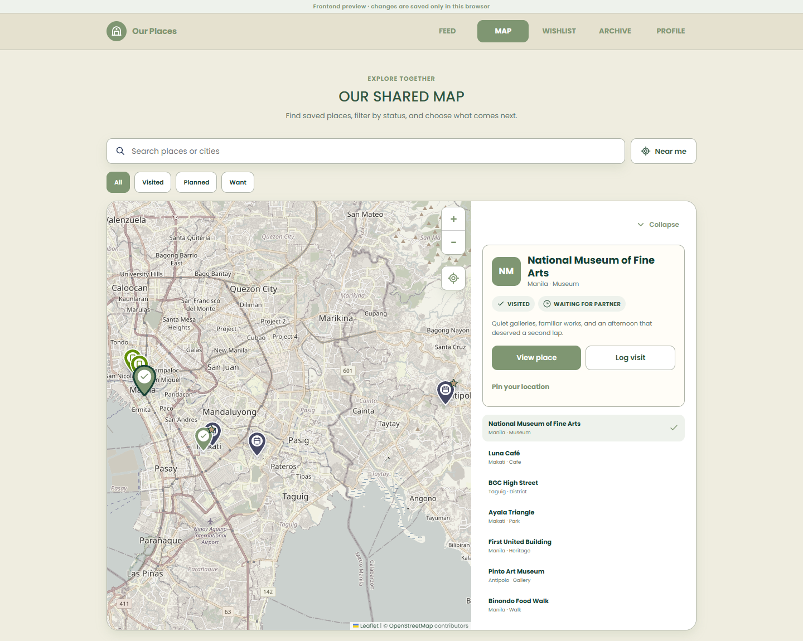
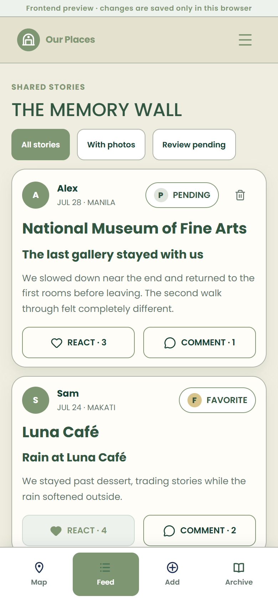

# Our Places

A private web app for two people to discover places, plan visits, keep a shared record of what they did together, and review each visit independently. Each person's review stays hidden from the other until both have submitted; then the combined score is revealed.

It covers restaurants, cafés, museums, parks, and any other place worth remembering.



## Features

- **Two invited accounts per shared space.** There is no public sign-up; accounts are created with a provisioning script.
- **Map and search.** Places sit at their real coordinates on an OpenStreetMap map. Filter by status (want to visit, planned, visited), search by name, city, or category, and use Near me or pin your location.
- **Log an experience** in four steps: place and date, story, photo (browser preview only), and a private rating with a short reflection.
- **Blind reviews.** Your partner's review is withheld by the server query until both reviews exist, then the shared score appears.
- **Feed** with filters for photos and pending reviews, plus reactions and private comments.
- **Place pages, wishlist, archive, and profile** with display names and preferences.

## Tech stack

Next.js 16 (App Router), React, TypeScript · PostgreSQL through `pg` · Leaflet with OpenStreetMap tiles · Zod validation · custom email/password sign-in with scrypt hashes and database-backed sessions · Vitest with PGlite for tests.

## Getting started

### Requirements

- Node.js 20.9 or newer and npm
- PostgreSQL 13 or newer, only for the signed-in version with saved data

### Install

```bash
git clone https://github.com/gbmagat/HAU-6APSI-FINAL-PROEJCT.git
cd HAU-6APSI-FINAL-PROEJCT
npm ci
```

On Windows PowerShell, use `npm.cmd` if the execution policy blocks `npm`.

### Configure

Copy `.env.example` to `.env.local`.

| Variable | Purpose |
|---|---|
| `DATABASE_URL` | Server-only PostgreSQL connection string. Leave empty to use the frontend preview. Never commit a real value. |
| `NEXT_PUBLIC_PLACE_PROVIDER` | Placeholder for the planned map provider (`openstreetmap`). Not used yet. |
| `NEXT_PUBLIC_PLACE_API_KEY` | Placeholder for that provider. Not used yet. |

The app runs in one of three modes:

- **Development without `DATABASE_URL`:** a frontend preview with sample data, saved only in the browser. The Profile page can switch between the two sample members, which is the easiest way to try the blind reviews.
- **With `DATABASE_URL`:** sign-in is required, and all data is loaded from and saved to PostgreSQL through the API routes.
- **Production without a database:** private pages redirect to sign-in and the preview is disabled.

### Database setup

1. Create a new, empty PostgreSQL database and a dedicated login role for this app only.
2. Apply the schema once:
   ```bash
   psql -h 127.0.0.1 -U our_places_app -d our_places -v ON_ERROR_STOP=1 -f db/schema.sql
   ```
3. Create the two accounts in an interactive terminal. The script checks the database is empty, asks for a typed confirmation, and reads passwords without echoing them.
   ```bash
   node scripts/provision-space.mjs --database our_places --owner-email YOU@example.com --owner-name "Your name" --partner-email PARTNER@example.com --partner-name "Partner name"
   ```

See [db/README.md](db/README.md) for server and hosting notes. The `supabase/` folder is an earlier design kept for history; do not apply it.

## Commands

| Command | What it does |
|---|---|
| `npm run dev` | Start the development server at http://localhost:3000 |
| `npm run check` | Lint, type-check, and run all tests |
| `npm run build` | Create the production build |
| `npm start` | Run the production build |
| `npm run test` | Run the tests only |

## Usage

Sign in, find a place on the map, and log an experience with your own review. Your partner sees the post in the feed and adds their review from the place page. Once both reviews exist, the shared score and both reflections appear together.

| Route | Purpose |
|---|---|
| `POST /api/auth/login` | Sign in; an account locks for 15 minutes after five failed attempts |
| `POST /api/auth/logout` | End the current session |
| `GET /api/state` | Load the shared space, including only the reviews the signed-in member may see |
| `POST /api/visits` | Publish an experience and its first review; safe to retry with the same draft key |
| `POST /api/visits/{id}/review` | Submit the second member's review |
| `POST /api/actions` | Favorites, place status, comments, reactions, display name, preferences, and deleting your own post |

All write routes reject requests from other origins and require a session. Personal responses are sent with `Cache-Control: private, no-store`.

## Project structure

```
src/app/          Pages, layouts, and API route handlers
src/components/   Screens, forms, and reusable UI
src/lib/          Database access, sessions, passwords, validation, app rules, and tests
db/               PostgreSQL schema and server setup notes
scripts/          Account provisioning and dev tooling
public/           SVG images and icons
docs/             README screenshots
project/          Coursework submissions
supabase/         Earlier Supabase design, not used
```

## Testing

`npm run check` runs 48 tests. They cover the rating and review-visibility rules, place and feed logic, form validation, password hashing, and the database schema. They also run the real API route handlers against an in-memory PostgreSQL (PGlite), checking blind reviews, retry safety, cross-site and signed-out rejection, per-member favorites, post deletion, and sign-in lockout.

## Screenshots

| Place page after both reviews | Map |
|---|---|
|  |  |



## Known issues and next steps

- The server code has only been tested against the in-memory database, not a running PostgreSQL server.
- Adding new places is not built yet, so a fresh production database starts with no places.
- Photo uploads work only in the browser preview; the server accepts text-only experiences.
- Map tiles come from OpenStreetMap's public tile server, which suits light personal use; heavier use would need a dedicated tile provider. Loading tiles tells that server which area you are viewing.
- Review reminders are saved as a preference but no notifications are sent.
- Next: test against a real database with both accounts, build place creation and private photo storage, then deploy to a VPS behind HTTPS with backups.
